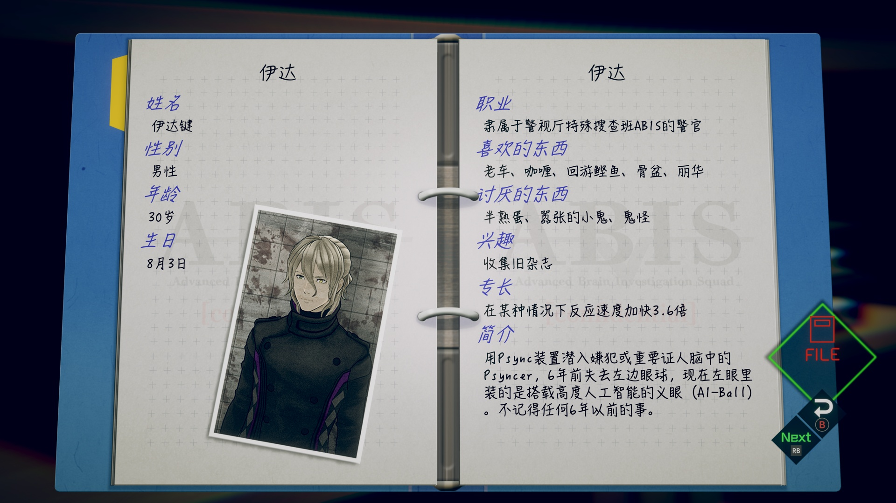
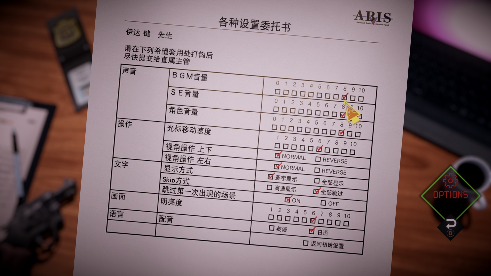

# 《AI：梦境档案》简体中文补丁

## 基本说明

《AI：梦境档案》有官方繁体中文而没有官方简体中文，虽然也能看懂，但有时候也会有些字不认识，因此想到可以通过替换游戏内字体文件的方式来实现“伪·简体中文”：也就是把繁体中文的字形换成简体中文的字形，而对应的码位不变，即“繁体源码、简体显示”。

自 4.0 版本起，大部分图片形式的繁体中文也被替换为简体中文。由于技术和精力有限，操作说明及结尾动画中的繁体中文未被替换为简体中文。

**禁止商用。转载请保留作者名（Xzonn）、发布链接及以上说明。**

## 使用方式

视频指南：<https://www.bilibili.com/video/BV1At4y1P7B7/>

将补丁工具和“patch.xzp”文件解压到同一个文件夹下。打开补丁工具，选择游戏所在的文件夹，然后选择“应用补丁”。

补丁下载地址：

- GitHub：<https://github.com/Xzonn/AITSFChsPatch/releases/download/v4.0/AI.The.Somnium.Files.Chs.Patch.v4.0.zip>
- 百度网盘：<https://pan.baidu.com/s/1eRwH9p6eIArFemHcDQ90CQ?pwd=aisf>

## 截图预览

  
  

## 相关链接

- [补丁创建工具](https://github.com/Xzonn/AITSFChsPatchCreater)
- [补丁应用工具](https://github.com/Xzonn/AITSFChsPatcher)
- [其乐论坛发布链接](https://keylol.com/t839952-1-1)
- [AI: The Somnium Files 中 Lua 文件的文本提取方法和工具](https://keylol.com/t810311-1-1)（作者：weiyun）
